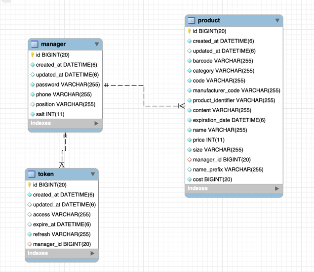

# 프로젝트 실행 방법
1. 프로젝트 루트 경로로 이동 후 아래 명령어 실행
```
./gradlew clean build
```

2. 1번 수행 후 아래 명령어 실행
```
docker-compose up
```

3. API 테스트 : http://locahost:9000

# 테이블 설계


## manager
- phone : 회원가입에 필요한 핸드폰 번호
- password: 회원가입에 필요한 비밀번호
- salt : 비밀번호 암호화에 필요한 요소
- position : 직책
- created_at : 회원가입 시간
- updated_at : 수정 시간

### 설명
- 직책 : 현재는 사장님이라는 직책만 존재하고 있지만 나중에 매니저, 아르바이트생이 존재할 가능성이 있어 해당 컬럼을 만들었습니다.
- salt : 비밀번호만 단순하게 암호화를 할경우 레인보우 테이블로 인해 암호화된 비밀번호가 해킹되어 해당 프로그램에서 악의적인 행동을 할  위험이 있어 비밀번호 + salt한 결과를 암호화 하여 비밀번호 유출을 방지하기 위해 컬럼을 생성하였습니다.

## token
- refresh : 리프레쉬 토큰
- access : 액세스 토큰
- expire_at : 리프레쉬 토큰 만료시간
- manager_id : 로그인한 사장님
- created_at : 생성시간
- updated_at : 수정시간

## product
- category : 카테고리
- name : 상품 이름
- price : 가격
- cost : 원가
- size : 사이즈
- content : 상품 설명
- code : GS1으로부터 할당받은 회사 또는 단체 고유 코드
- manufacturer_code : GS1으로 부터 할당받은 제조사 코드
- product_identifier : 상품 고유 코드
- name_prefix : 상품 이름 초성
- barcode : 상품에 대한 바코드 일련번호
- manager_id : 상품 등록한 사장님
- expiration_date : 유통기한
- created_at : 생성시간
- updated_at : 수정시간

### 설명
- barcode : 바코드의 일련번호는 회사 또는 단체 고유코드(code) + 제조사 코드(manufacturer_code) + 상품 고유코드(product_identifier) + 검증숫자로 이루어져 있습니다.
- name_prefix : 상품을 초성으로 검색할 시 사용할 컬럼입니다.

# API 명세서

## 회원가입
POST /api/manager

RequestBody
```json
{
  "phone" : 핸드폰 번호,
  "password" : 비밀번호
}
```

성공 응답
```json
{
    "meta": {
        "code": 200,
        "message": "ok"
    },
    "data": null
}
```

실패 응답
1. 011로 시작하는 핸드폰 번호가 10글자 미만 또는 초과일 경우
```json
{
  "meta": {
    "code": 400,
    "message": "011로 시작하는 핸드폰 번호는 10글자여야 합니다."
  },
  "data": null
}
```
2. 010으로 시작하는 핸드폰 번호가 11글자 미만 또는 초과일 경우
```json
{
    "meta": {
        "code": 400,
        "message": "010으로 시작하는 핸드폰 번호는 11글자여야 합니다."
    },
    "data": null
}
```

3. 이미 가입된 정보가 있을경우
```json
{
    "meta": {
        "code": 409,
        "message": "이미 가입된 정보입니다."
    },
    "data": null
}
```

### 설명
- 회원가입시 회원의 기본 직책(position)은 사장님으로 설정해두었습니다. 
- 비밀번호 암호화는 비밀번호 + 무작위 숫자(salt)를 조합한 결과를 암호화를 하였습니다.
- 핸드폰 번호 제약조건
  - 010으로 시작하는 핸드폰 번호
    - 하이픈 제거
    - 11글자 미만 또는 초과일 경우 예외 발생
  - 011로 시작하는 핸드폰 번호
    - 하이픈 제거
    - 10글자 미만 또는 초과일 경우 예외 발생
- 핸드폰 번호로 이미 가입된 정보가 있을 경우 예외 발생

## 로그인
POST /api/manager/login

RequestBody
```json
{
  "phone" : 핸드폰 번호,
  "password" : 비밀번호
}
```

성공 응답
```json
{
    "meta": {
        "code": 200,
        "message": "ok"
    },
    "data": null
}
```
ResponseHeader(Cookie)
```json
name : loginInfo
value : {accessToken}
```

실패 응답
1. 아이디 또는 비밀번호가 일치하지 않을 경우
```json
{
    "meta": {
        "code": 400,
        "message": "아이디 또는 비밀번호가 일치하지 않습니다."
    },
    "data": null
}
```

### 설명
- 로그인 할 핸드폰 번호 및 비밀번호를 체크
  - 핸드폰 번호 또는 비밀번호가 일치 하지 않을경우 예외처리
  - 일치하는 경우 로그인
- 로그인 성공시
  - accessToken과 refreshToken 발급 및 데이터베이스에 저장
  - accessToken값 쿠키에 담아서 응답

## 로그아웃
POST /api/manager/logout

RequestHeader 
```json
Authorization : Bearer {access 토큰}
```

ResponseBody
```json
{
    "meta": {
        "code": 200,
        "message": "ok"
    },
    "data": null
}
```
### 설명
- 헤더에 담긴 토큰을 기반으로 토큰이 담긴 테이블에서 토큰을 조회합니다.
- 조회한 토큰을 삭제하여 로그아웃을 완료합니다.


# 상품 등록
POST /api/product

RequestHeader
```json
Authorization : Bearer {access 토큰}
```

RequestBody
```json
{
    "category" : 카테고리,
    "price" : 가격,
    "cost" : 원가,
    "name" : 상품 이름,
    "content" : 상품 설명,
    "expirationDate" : 유통기한,
    "size" : 사이즈,
    "code" : GS1으로부터 할당받은 회사 또는 단체 고유 코드,
    "productIdentifier" : 상품 고유 코드,
    "manufacturerCode" : GS1으로부터 할당받은 제조사 코드
}
```

성공 응답
```json
{
    "meta": {
        "code": 200,
        "message": "ok"
    },
    "data": null
}
```

실패 응답

1. 로그인 한 사용자가 아닐경우

```json
{
    "meta": {
        "code": 401,
        "message": "인증된 사용자가 아닙니다."
    },
    "data": null
}
```

2. 이미 등록된 바코드 일련번호일 경우

```json
{
    "meta": {
        "code": 409,
        "message": "이미 존재하는 바코드입니다."
    },
    "data": null
}
```

3. 상품 사이즈가 SMALL 또는 LARGE가 아닐경우
```json
{
    "meta": {
        "code": 400,
        "message": "잘못된 상품 사이즈 입니다."
    },
    "data": null
}
```

### 설명
- 헤더에 담긴 토큰으로 로그인 한 회원 정보를 받습니다.
- 로그인 한 사용자가 아닐 경우
  - 예외가 발생하여 상풍 등록 불가능
- 로그인 한 사용자일 경우 상품 등록 가능
  - barcode : code + manufacturerCode + productIdentifier + 검증 숫자
- 등록하려는 상품의 바코드가 이미 등록된 바코드 일련번호일경우 예외 발생
- 상품 사이즈가 SMALL 또는 LARGE가 아닌 경우 예외 발생


## 상품 상세보기

GET /api/product/{product-id}

RequestHeader
```json
Authorization : Bearer {access 토큰}
```

PathVariable
```json
{product-id}
```

성공 응답
```json
{
    "meta": {
        "code": 200,
        "message": "ok"
    },
    "data": {
        "products": {
            "name": 상품이름,
            "price": 가격,
            "cost": 원가,
            "content": 상품 설명,
            "expirationDate": 유통기한,
            "size": 사이즈
        }
    }
}
```

실패 응답

1. 로그인 한 사용자가 아닐경우

```json
{
    "meta": {
        "code": 401,
        "message": "인증된 사용자가 아닙니다."
    },
    "data": null
}
```
2. 로그인 한 사용자가 등록한 상품이 아닐 경우

```json
{
    "meta": {
        "code": 404,
        "message": "존재하지 않는 상품정보입니다."
    },
    "data": null
}
```

### 설명
- 헤더에 담긴 토큰으로 로그인 한 회원 정보를 받습니다.
- 로그인 한 사용자가 아닐 경우
  - 예외가 발생하여 상풍 상세보기 불가능
- 로그인 한 사용자일 경우
  - 로그인 한 사용자가 등록한 상품일 경우 상품 상세보기 가능
  - 로그인 한 사용자가 등록한 상품이 아닐 경우 예외가 발생하여 상세보기 불가능

## 상품 삭제

DELETE /api/product/{product-id}

RequestHeader
```json
Authorization : Bearer {access 토큰}
```

PathVariable
```json
{product-id}
```

성공 응답

```json
{
    "meta": {
        "code": 200,
        "message": "ok"
    },
    "data": null
}
```

실패 응답

1. 로그인 한 사용자가 아닐경우

```json
{
    "meta": {
        "code": 401,
        "message": "인증된 사용자가 아닙니다."
    },
    "data": null
}
```
2. 로그인 한 사용자가 등록한 상품이 아닐 경우

```json
{
    "meta": {
        "code": 404,
        "message": "존재하지 않는 상품정보입니다."
    },
    "data": null
}
```
### 설명
- 헤더에 담긴 토큰으로 로그인 한 회원 정보를 받습니다.
- 로그인 한 사용자가 아닐 경우
  - 예외가 발생하여 삭제 불가능
- 로그인 한 사용자일 경우
  - 로그인 한 사용자가 등록한 상품일 경우 삭제 가능
  - 로그인 한 사용자가 등록한 상품이 아닐 경우 예외가 발생하여 삭제 불가능

## 상품 수정

PUT /api/product/{product-id}

RequestHeader
```json
Authorization : Bearer {access 토큰}
```

PathVariable
```json
{product-id}
```

성공 응답

```json
{
    "meta": {
        "code": 200,
        "message": "ok"
    },
    "data": null
}
```

실패 응답

1. 로그인 한 사용자가 아닐경우

```json
{
    "meta": {
        "code": 401,
        "message": "인증된 사용자가 아닙니다."
    },
    "data": null
}
```
2. 로그인 한 사용자가 등록한 상품이 아닐 경우

```json
{
    "meta": {
        "code": 404,
        "message": "존재하지 않는 상품정보입니다."
    },
    "data": null
}
```

3. 회사 또는 단체 코드, 제조사 코드, 상폼 코드를 수정하여 이미 등록되어 있는 바코드 일련번호와 동일 할 경우

```json
{
    "meta": {
        "code": 409,
        "message": "이미 존재하는 바코드입니다."
    },
    "data": null
}
```
### 설명
- 헤더에 담긴 토큰으로 로그인 한 회원 정보를 받습니다.
- 로그인 한 사용자가 아닐 경우
  - 예외가 발생하여 수정 불가능
- 로그인 한 사용자일 경우
  - 로그인 한 사용자가 등록한 상품일 경우 수정 가능
  - 로그인 한 사용자가 등록한 상품이 아닐 경우 예외가 발생하여 수정 불가능
- 상품 수정시 회사 또는 단체 코드, 제조사 코드, 상풍코드를 수정하여 이미 등록되어 있는 바코드 일련번호와 동일 할 경우 예외가 발생하여 상품 수정 불가능

## 상품 목록 및 검색
GET /api/product?keyword=키워드

RequestHeader
```json
Authorization : Bearer {access 토큰}
```

RequestParam
```json
?keyword=키워드
```

성공 응답
```json
{
  "meta": {
    "code": 200,
    "message": "ok"
  },
  "data": {
    "products": {
      "isLast": true,
      "isFirst": true,
      "limit": 10,
      "page": 0,
      "infos": [
        {
          "productId": 상품 고유id,
          "name": 상품이름,
          "price": 가격,
          "content": 상품 설명,
          "expirationDate": 유통 기한,
          "size": 사이즈,
          "createdAt": 상품 등록 시간
        }
      ]
    }
  }
}
```


### 설명
- 헤더에 담긴 토큰으로 로그인 한 회원 정보를 받습니다.
- 로그인 한 사용자가 아닐 경우
  - 예외가 발생하여 목록 조회 및 검색 불가능
- 로그인 한 사용자일 경우
  - 로그인 한 사용자가 등록한 상품만 목록 조회 및 검색 가능


# 부분 코드 설명

## 전역 예외 처리
```kt
@RestControllerAdvice
class GlobalExceptionProcessor {

    @ExceptionHandler(CommonException::class)
    fun payhereExceptionResponse(
        commonException: CommonException
    ): ResponseEntity<CommonResponse> {
        return CommonExceptionResponse.toResponse(errorCode = commonException.errorCode)
    }

  @ExceptionHandler(MissingKotlinParameterException::class)
  fun notNullExceptionResponse(e: MissingKotlinParameterException): ResponseEntity<CommonResponse> {
    return CommonExceptionResponse.toNotNullableResponse("${e.path[0].fieldName} 필수로 입력해야합니다.")
  }
}
```
### 설명
- RestControllerAdvice를 사용하여 런타임시 발생하는 예외에 대해 커스텀 예외를 만들고 전역적으로 처리할 수 있게 구현하였습니다.
- NotNull 특성을 가진 필드의 값이 null로 들어왔을때에 대한 예외처리도 추가적으로 구현하였습니다.


## api, app 패키지

### 설명
- 클라이언트로부터 들어오는 요청과 내부에서 처리하는 로직을 분리하기 위해 api와 app 이라는 패키지로 분리하였습니다.
- 클라이언트로 들어오는 RequestDTO, ResponseDTO를 내부에서 처리하는 로직과 분리하기 위해 api와 app 패키지별로 dto 패키지를 생성하였습니다.


## @LoginUser

@LoginUser
```kt
@Target(AnnotationTarget.ANNOTATION_CLASS, AnnotationTarget.VALUE_PARAMETER)
@Retention(AnnotationRetention.RUNTIME)
@MustBeDocumented
annotation class LoginUser
```

LoginInterceptor
```kt
class LoginInterceptor(
    private val managerRepository: ManagerRepository
) : HandlerMethodArgumentResolver {
    override fun supportsParameter(parameter: MethodParameter): Boolean {
        return parameter.hasParameterAnnotation(LoginUser::class.java)
    }

    override fun resolveArgument(
        parameter: MethodParameter,
        mavContainer: ModelAndViewContainer?,
        webRequest: NativeWebRequest,
        binderFactory: WebDataBinderFactory?
    ): Any? {
        val authentication = SecurityContextHolder.getContext().authentication
        val manager = managerRepository.findByPhone(authentication.name)
            ?: throw CommonException(CommonErrorCode.ACCESS_TOKEN_EXPIRE)
        return LoginInfo(manager.id)
    }
}
```

### 설명
- 로그인 시 로그인 정보를 담을 수 있게 커스텀 어노테이션을 생성하였습니다.
  - 인터셉터를 활용하여 해당 어노테이션이 붙은 API에는 사용자 정보가 포함되어있습니다.

## TokenAccessDeniedHandler

### 설명
- 현재 "사장님" 권한밖에 존재하지 않지만 추후에 매니저, 아르바이트생 등 다양한 권한이 생길 가능성을 열어두고 "인가"에 대한 로직을 구현하였습니다.


## 비밀번호 암호화
```kt
 private fun encodePassword(salt: Int, password: String): String { 
     return bCryptPasswordEncoder.encode(password + salt)
 }
```
### 설명 
- 비밀번호 암호화를 진행할때 사용자가 입력한 비밀번호가 아닌 무작위 숫자 또는 문자를 입력한 비밀번호와 합성 한 뒤 암호화를 진행하였습니다. 이와 같이 진행한 이유는 레인보우 테이블에 의해 사용자 비밀번호까지 유출하게 된다면 악의를 가진 제 3자로 인해 해당 프로그램에 영향을 끼칠 수 있어 이를 방지하고자 사용자가 입력한 비밀번호 + 무작위 숫자를 합성하여 암호화를 진행하였습니다.


## 바코드 일련번호 생성
```kt
class Barcode {

    companion object {
        fun create(
            code: String,
            manufacturerCode: String,
            productIdentifier: String
        ): String {
            val barcodeWithoutCheckDigit = code + manufacturerCode + productIdentifier
            val checkDigit = calculateCheckDigit(barcodeWithoutCheckDigit)
            return barcodeWithoutCheckDigit + checkDigit
        }

        private fun calculateCheckDigit(barcode: String): Char {
            var sum = 0
            for (i in barcode.indices) {
                val digit = barcode[i] - '0'
                sum += if (i % 2 == 0) digit else digit * 3
            }
            val checkDigit = (10 - sum % 10) % 10
            return ('0' + checkDigit)
        }
    }
}
```
### 설명
- 바코드 일련 번호 생성은 대적으로 사용하는 규칙 중 하나인 GS1 바코드 규격에 맞춰서 생성하였습니다.
- GS1 바코드 규격
  - 접두사 : 제품을 판매하는 조직 또는 국가
  - 제조사 코드 : 제품을 제조하는 회사 코드
  - 제품식별자 : 제품의 고유한 코드값
  - 검증 숫자 : 기타 숫자들의 유효성 확인값


